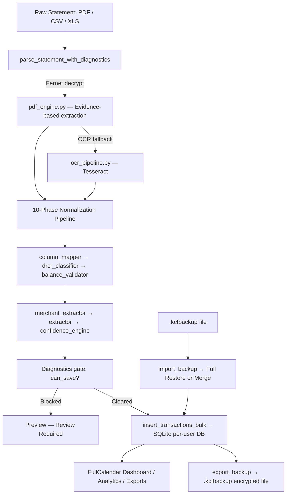

# KC Tracker — Banking Ledger &amp; Parser Suite

<p align="center">
  
  
  
  
  
  
  
</p>

<p align="center">
  A self-hosted, multi-user financial dashboard that converts raw bank statements (PDF, CSV, Excel) into a structured, searchable, double-entry ledger. Built for individuals and small businesses — featuring an auto-learning merchant intelligence engine, AES-256 encrypted bank password vault, and a fully offline encrypted backup/restore system, all behind a beautiful glassmorphism UI.<br><br>
</p>

---

## System Architecture

The project exposes **two parallel servers** sharing the same backend modules:

| Server | File | Framework | Purpose |
|--------|------|-----------|---------| 
| **Primary** | `main.py` |  **FastAPI + Uvicorn** | Production async server (current default) |
| **Legacy** | `app.py` |  **Flask + Flask-Limiter** | Retained for compatibility; same routes |

Both servers share all `backend/` modules, `templates/`, `static/`, `data/`, and `config.py`.



---

## 🔄 The 10-Phase Parsing &amp; Normalization Pipeline

Every uploaded file passes through [`backend/parser.py`](backend/parser.py) — `parse_statement_with_diagnostics()`:

| Phase | Module | What It Does |
|-------|--------|-------------|
| 1. **File resolution** | `parser.py` | Detects extension + MIME type; calls `allowed_file()` |
| 2. **Credential decrypt** | `security.py` | Fetches encrypted PDF password from SQLite vault; decrypts in-memory with Fernet |
| 3. **PDF extraction** | `pdf_engine.py` | Evidence-based mode selection: ruled-table → fixed-width → layout-text → OCR |
| 4. **OCR fallback** | `ocr_pipeline.py` | Renders pages with `pdf2image`, runs `pytesseract` on scanned images |
| 5. **Garbage filter** | `garbage_filter.py` | Drops empty rows, headers, footers, and non-transaction junk |
| 6. **Row segmentation** | `row_segmenter.py` | Merges multi-line transactions split across PDF rows |
| 7. **Column mapping** | `column_mapper.py` | Normalises heterogeneous headers → `date / description / debit / credit / balance` |
| 8. **DR/CR alignment** | `drcr_classifier.py` | Splits combined amount columns using `DR`, `CR`, `+`, `-` indicators |
| 9. **Balance validation** | `balance_validator.py` | Verifies: `Balance_N = Balance_{N-1} + Credit_N − Debit_N` row-by-row |
| 10. **Merchant extraction** | `merchant_extractor.py` + `extractor.py` | Strips UPI/NEFT prefixes, extracts merchant name; applies saved alias mappings |

After phase 10, `confidence_engine.py` assigns a quality score. The **diagnostics gate** sets `can_save = False` if reconciliation fails, blocking save until the user reviews.

---

## Technical Stack

### Backend

| Layer | Technology |
|-------|-----------|
| Primary web framework |  **FastAPI** with  **Uvicorn** (ASGI) |
| Legacy web framework |  **Flask** with **Flask-Limiter** |
| Session middleware | `SessionMiddleware` (FastAPI) / `flask.session` |
| Database |  **SQLite 3** — multi-tenant isolated per-user `.db` files |
| ORM / Query layer | Raw `sqlite3` via `backend/database.py` |
| Data processing |  **pandas**, pdfplumber, xlrd, openpyxl |
| PDF extraction | **pdfplumber** (primary), PyPDF2, pdf2image + pytesseract (OCR) |
| Cryptography |  **cryptography** (Fernet / AES-256) for vault &amp; backup, **bcrypt** for auth |
| Backup format | Custom `.kctbackup` — PBKDF2 key derivation + Fernet-encrypted gzip tar |
| Async I/O | **anyio** for file operations in FastAPI routes |

### Frontend

| Layer | Technology |
|-------|-----------|
| UI framework |  **Bootstrap 5** |
| Calendar |  **FullCalendar v6** |
| Charts |  **Chart.js v4** |
| Styling |  Dark-mode design system (`static/css/style.css`) |
| Templating |  **Jinja2** (shared between Flask and FastAPI via `Jinja2Templates`) |

---

## Project Structure

```text
kt2/
│
├── main.py                     # ★ FastAPI entry point (primary)
├── app.py                      # Flask entry point (legacy / alternate)
├── config.py                   # Env vars, paths, Fernet key, ensure_directories()
├── requirements.txt            # All Python dependencies
├── data/                       # Writable runtime databases, exports, temp files
├── static/img/profiles/        # Writable profile photos (source + packaged runtime)
│
├── backend/                    # Shared core modules
│   ├── auth.py                 # register_user / login_user / bcrypt hashing
│   ├── balance_validator.py    # Running-balance integrity checker
│   ├── column_mapper.py        # Header normalisation across 13+ Indian bank formats
│   ├── confidence_engine.py    # Row-level quality scoring
│   ├── database.py             # All SQLite CRUD — transactions, daily_summary, aliases, credentials
│   ├── drcr_classifier.py      # Debit/credit column split & sign correction
│   ├── exporter.py             # PDF / Excel / TXT export generators
│   ├── extractor.py            # Applies saved merchant aliases to transactions
│   ├── format_detector.py      # Detects PDF table layout quality & extraction strategy
│   ├── garbage_filter.py       # Strips non-transaction rows from raw extractions
│   ├── ledger.py               # Groups transactions into double-entry ledger dicts
│   ├── merchant_extractor.py   # Regex-based narration → merchant name cleaning
│   ├── ocr_pipeline.py         # pdf2image → pytesseract OCR pipeline
│   ├── parser.py               # Orchestrator: parse_statement_with_diagnostics()
│   ├── pdf_engine.py           # Evidence-based multi-mode PDF extraction engine
│   ├── row_segmenter.py        # Multi-line transaction merger
│   ├── security.py             # encrypt_password / decrypt_password (Fernet)
│   └── backup.py               # Encrypted export/import — export_backup / preview_backup / import_backup
│
├── templates/                  # Jinja2 HTML templates
│   ├── base.html               # Master layout: sidebar, navbar
│   ├── dashboard.html          # FullCalendar interactive calendar
│   ├── analytics.html          # Chart.js income/expense/balance analytics
│   ├── profile.html            # User account stats, photo upload, bank vault list
│   ├── login.html              # Login page
│   ├── register.html           # Registration page
│   ├── upload.html             # Drag-and-drop file upload zone
│   ├── preview.html            # Pre-save diagnostics & custom description editor
│   ├── statement.html          # Range-wise statement with period presets
│   ├── summary.html            # Single-day quick summary modal target
│   ├── ledger_details.html     # Full double-entry daily ledger view
│   └── statement_passwords.html# Encrypted bank password vault management
│
├── static/
│   └── css/style.css           # Custom glassmorphism dark-mode stylesheet
│
├── data/                       # Runtime storage — excluded from Git
│   ├── auth.db                 # Master authentication database (users)
│   ├── users/                  # Per-user SQLite databases: <username>.db
│   ├── exports/                # Temporary generated export files
│   ├── backups/                # Generated .kctbackup encrypted backup files
│   └── temp/                   # Temporary upload staging + preview JSON cache
│
└── graphify-out/               # Knowledge graph (auto-generated, do not edit)
```

---

## API Route Reference

Both `main.py` (FastAPI) and `app.py` (Flask) expose the same URL surface:

| Method | Route | Description |
|--------|-------|-------------|
| `GET` | `/` | Redirect → `/dashboard` or `/login` |
| `GET` `POST` | `/login` | Credential auth; rate-limited (10/min, 50/hr) |
| `GET` `POST` | `/register` | New user registration; rate-limited (5/hr) |
| `GET` | `/logout` | Session clear |
| `GET` | `/dashboard` | FullCalendar home screen |
| `GET` | `/api/events` | JSON calendar events (credit/debit heat map) |
| `GET` | `/api/summary/<date>` | JSON daily totals + per-bank balances |
| `GET` | `/summary/<date>` | HTML single-day summary |
| `GET` | `/ledger/<date>` | HTML double-entry daily ledger |
| `GET` | `/api/ledger/<date>` | JSON ledger data |
| `GET` `POST` | `/upload` | File upload + parse |
| `GET` `POST` | `/preview` | Pre-save review & confirm |
| `POST` | `/api/add-transaction/<date>` | Manual transaction entry |
| `POST` | `/api/update/<txn_id>` | Edit existing transaction |
| `POST` | `/api/delete/<txn_id>` | Delete transaction |
| `POST` | `/api/alias` | Save merchant display name alias |
| `GET` `POST` | `/get-statement` | Range statement with period presets |
| `GET` | `/export/date/<date>/<fmt>` | Export single day (pdf/xlsx/txt) |
| `GET` | `/export/range/<fmt>` | Export date range |
| `GET` | `/analytics` | Chart.js analytics dashboard |
| `GET` | `/api/chart-data` | JSON daily summaries for charts |
| `GET` | `/api/bank-balances` | JSON per-bank balance time series |
| `GET` `POST` | `/statement-passwords` | Manage encrypted PDF password vault |
| `POST` | `/api/bank-password/<bank_id>` | Delete a saved bank credential |
| `GET` | `/profile` | User profile & account stats |
| `POST` | `/profile/upload-photo` | Upload profile picture |
| `POST` | `/change-password` | Change account password |
| `GET` `POST` | `/settings` | App settings (backup/import UI) |
| `POST` | `/api/backup/export` | Export encrypted `.kctbackup` file |
| `POST` | `/api/backup/import/preview` | Preview backup metadata before import |
| `POST` | `/api/backup/import/execute` | Execute full restore or merge import |
| `GET` | `/api/recent-transactions` | JSON recent transactions (FastAPI only) |
| `GET` | `/api/debug-bank` | Debug: raw transaction + summary samples |

---

## UI Walkthrough

### Sidebar (Global)
- **Profile badge** — initial avatar or uploaded photo; opens dropdown with Change Password, Logout
- **Nav links** — Home, Upload, Passwords, Statement, Analytics, Settings

### Dashboard (`/dashboard`)
- FullCalendar monthly/weekly grid with green/red day backgrounds showing net cash flow
- Click any day → **Daily Summary Modal** (Total Debit / Credit / Net + per-bank breakdown) → **View Details** opens full ledger

### Upload (`/upload`)
- Bank dropdown (pre-populated from saved vault + 13 default banks)
- Drag-and-drop zone (PDF / CSV / XLSX / XLS, up to 16 MB)
- Parsing runs in the background; preview cached as `data/temp/<username>_preview.json`

### Preview (`/preview`)
- Shows parsed transactions grouped by date in double-entry layout
- Inline `user_description` text fields for custom notes per transaction
- Diagnostics panel warns if reconciliation failed (`can_save = False` blocks save)
- **Save All** → bulk insert → redirect to dashboard

### Ledger Details (`/ledger/<date>`)
- Side-by-side Debit / Credit tables
- Inline edit, delete, and merchant alias saving per row
- Previous / Next day navigation

### Analytics (`/analytics`)
- Monthly income vs. expense bar charts
- Running balance line chart
- Per-bank balance over time (via `rebuild_daily_summary`)

### Statement Generator (`/get-statement`)
- Preset periods: This Month, Last Month, Last 3/6 Months, This Year, FY Current/Previous, Recent 30 days, individual month, or custom date range
- Renders grouped ledger; export buttons for PDF / Excel / TXT

### Bank Password Vault (`/statement-passwords`)
- Add / delete encrypted PDF passwords per bank
- Passwords encrypted with Fernet before storage; never included in exports or logs

### Settings (`/settings`)
- **Export Backup** — generates an AES-encrypted `.kctbackup` file containing all transactions, merchant aliases, and profile image
- **Import Backup** — upload a `.kctbackup` file, preview its metadata (transaction count, date range, banks), then choose **Full Restore** (overwrite) or **Merge** (additive)

---

## Setup &amp; Installation

### Prerequisites

<p>
  
  
  
</p>

- **Python 3.10+**
- **Tesseract OCR** + **Poppler** *(required only for scanned/image-only PDFs)*

### 1️⃣ Clone &amp; Install

```bash
git clone https://github.com/your-repo/kc-tracker.git
cd kc-tracker
pip install -r requirements.txt
```

### 2️⃣ Configure Environment

```bash
cp .env.example .env
```

Edit `.env`:

```ini
# Flask/FastAPI session signing key
SECRET_KEY="generate-with: python -c \"import secrets; print(secrets.token_hex(32))\""

# Fernet AES-256 key for bank password vault and backups
# Generate: python -c "from cryptography.fernet import Fernet; print(Fernet.generate_key().decode())"
ENCRYPTION_KEY="your-fernet-key-here="
```

### 3️⃣ Run the Server

**FastAPI (primary):**
```bash
python main.py
# or: uvicorn main:app --host 127.0.0.1 --port 5000 --reload
```

**Flask (legacy):**
```bash
python app.py
```

Open `http://127.0.0.1:5000/` → register → log in.

The Flask launcher starts a local Waitress server and opens the default browser automatically.

### 4️⃣ Build the Windows `.exe`

The Flask path can be packaged as a single-file executable.

```powershell
.\build_kctracker.ps1 -Clean
```

Output:
```text
dist\KCTracker.exe
```

Keep only `.env` next to the exe at runtime.

The executable creates and uses these writable folders beside itself:

- `data/`
- `static/img/profiles/`

---

## Security Model

<p>
  
  
  
  
</p>

| Concern | Implementation |
|---------|---------------|
| User passwords | bcrypt salted hash stored in `auth.db` |
| Bank PDF passwords | Fernet (AES-256-CBC) encrypted at rest in per-user DB; decrypted in-memory only |
| Session integrity | Server-side session key (`SECRET_KEY`); `SameSite=lax` cookie |
| Login brute-force | Rate-limited: 10 req/min, 50 req/hr (FastAPI: in-memory token bucket; Flask: Flask-Limiter) |
| Backup encryption | PBKDF2-HMAC-SHA256 (600,000 iterations) key derivation + Fernet (AES-128-CBC + HMAC-SHA256) on `.kctbackup` files |
| Data isolation | Each user has a dedicated `data/users/<username>.db`; no cross-user queries |
| Encryption key | Never included in backups; never falls back to a hardcoded value (raises `RuntimeError` if missing) |

---

## Supported Banks

<p>
  
  
  
  
  
</p>

The column mapper and merchant extractor have built-in patterns for:

**HDFC · BOB · IOB · Indian Bank · KVB**

Any additional bank can be added by selecting **"Other"** at upload time. The system will auto-detect and map columns; a custom bank name can be saved to the vault for password-protected statements.

---

## Export Formats

| Format | Route | Library Used |
|--------|-------|-------------|
|  | `/export/date/<date>/pdf` | fpdf2 |
|  | `/export/date/<date>/xlsx` | openpyxl |
|  | `/export/date/<date>/txt` | Built-in |
| Range exports | `/export/range/<fmt>?start=&end=` | Same libraries |

Exports are generated on-demand, streamed to the browser,then deleted from `data/exports/`.

---

## Data Backup &amp; Restore

KC Tracker v2.0.0 ships a fully offline, self-contained backup system accessible from **Settings (`/settings`)**.

### Backup Format — `.kctbackup`

```
[8-byte magic: KCTBKP01] [4-byte header length] [JSON header] [Fernet-encrypted gzip tar]
```

The outer JSON **header** (readable without a password) contains:
- App version, export date, originating username
- Data summary: transaction count, date range, bank count
- `has_profile_image` flag

The encrypted payload is a **gzip-compressed tar** archive containing:
1. `user.db` — the full per-user SQLite database (transactions, aliases, bank credentials)
2. `auth_user.json` — the login credential row (for full restore)
3. `profile.jpg` — profile photo (if one exists)
4. `manifest.json` — SHA-256 checksums for all files

### ⬆️ Export
- Navigate to **Settings → Backup** and enter a backup password.
- `export_backup(username, password)` generates `data/backups/<username>_backup_<timestamp>.kctbackup` and streams it to the browser.
- Encryption key is derived per-file using PBKDF2-HMAC-SHA256 (600,000 iterations) with a random 16-byte salt.

### ⬇️ Import
1. **Preview** — upload the `.kctbackup` file; the server reads the unencrypted header and returns metadata (no password needed).
2. **Authenticate** — provide the backup password; the server decrypts and verifies SHA-256 checksums of all inner files.
3. **Choose mode:**
   - 🔄 **Full Restore** — overwrites the target user's database, login credentials, and profile image atomically.
   - ➕ **Merge** — additively inserts new transactions (`INSERT OR IGNORE`) and merchant aliases (`ON CONFLICT UPDATE`) without touching existing records; daily summaries are rebuilt after.
