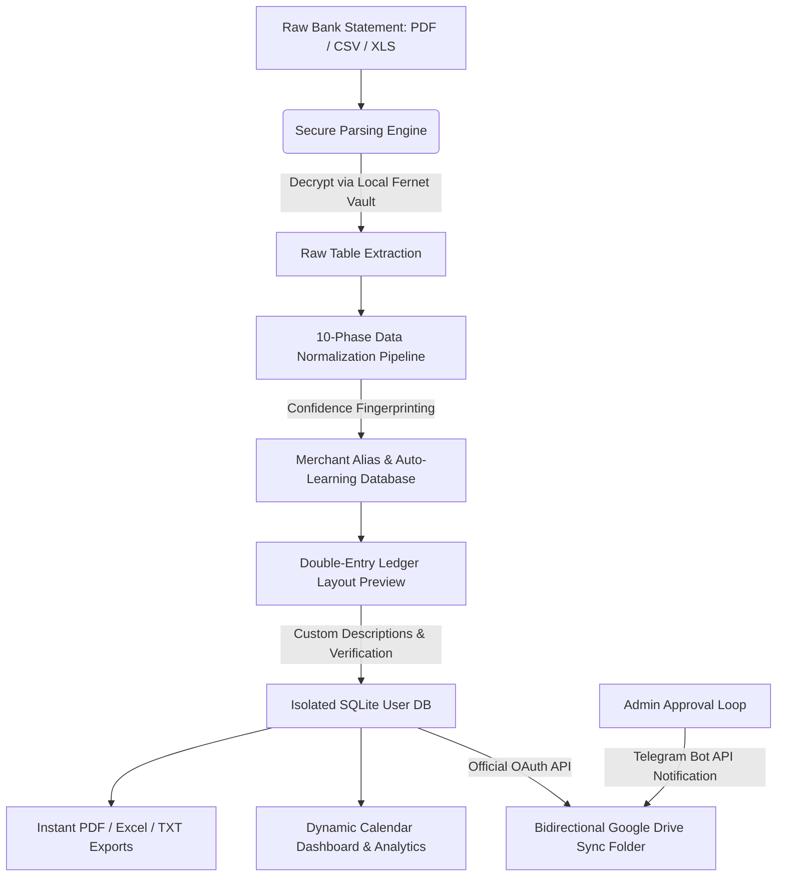

# 🪙 KC Tracker — Complete Banking Ledger & Parser Suite

KC Tracker is a premium, secure, and enterprise-ready bank statement parsing and ledger management dashboard. Built for individuals and small businesses, KC Tracker converts disorganized, multi-format financial statements (from PDFs, CSVs, and Excel files) into beautifully structured, normalized ledger accounts. 

Equipped with a local secure password vault, an auto-learning merchant cleaning database, dynamic analytical tools, and a bidirectional Google Drive cloud synchronization engine, KC Tracker is the ultimate self-hosted control center for your financial data.

---

## 🗺️ High-Level System Architecture & Pipelines

The system is split into two halves: a high-speed Python core backend orchestrating mathematical validation, layout-aware PDF extraction, cryptographic operations, and cloud sync; and a gorgeous Bootstrap 5, FullCalendar, and Chart.js frontend dashboard designed for micro-interactions and smooth user workflows.



### 1. The 10-Phase Parsing & Normalization Pipeline (`backend/parser.py`)
When you drop a bank statement into the upload zone, the file passes through a multi-layered sanitization pipeline:
1. **File Type Resolution:** Auto-detects the extension and MIME type.
2. **Decryption Check:** If the PDF is password-protected, the server queries the local database for the bank's encrypted credentials, decrypts them in memory using **AES-256 (Fernet)**, and opens the file.
3. **Table Extraction:** Utilizes `pdfplumber` for native text layout detection. If scanned, it falls back to character distance extraction.
4. **Segmentation Filter (`row_segmenter.py`):** Combines multi-line transactions (common in HDFC and SBI statements where the narration wraps onto two or three rows) back into unified rows.
5. **Garbage Sweeper (`garbage_filter.py`):** Trashes empty padding rows, non-transaction lines, header metadata, page count footers, and advertisement text blocks.
6. **Column Mapping Engine (`column_mapper.py`):** Translates varying headers across banks (e.g., `Value Date`, `Transaction Date`, `Post Date`, `Txn Date`) into standardized internal fields (`date`, `description`, `debit`, `credit`, `balance`).
7. **Debit/Credit Realignment (`drcr_classifier.py`):** Resolves bank-specific formatting anomalies. If debits and credits are combined in a single column marked with indicators (e.g., `DR`, `CR`, `+`, `-`), the engine splits and normalizes them.
8. **Mathematical Balance Validator (`balance_validator.py`):** Verifies ledger integrity by ensuring that for every row $N$, $Balance_N = Balance_{N-1} + Credit_N - Debit_N$. Errors are highlighted for correction.
9. **Merchant Alias Translator (`extractor.py` & `merchant_extractor.py`):** Runs complex bank descriptions (e.g., `UPI-PAYTM-UPI239849201@okaxis-WENDYS-RESTAURANT`) through regex cleaning patterns to extract the true Merchant. If the user has saved a manual display name replacement (e.g., mapping `WENDYS-RESTAURANT` to `Wendy's`), it is automatically applied.
10. **Idempotent Deduplicator:** Ensures uploaded transactions do not duplicate existing database records using database constraints on `(date, description, debit, credit, balance)`.

---

## 💻 Technical Stack

- **Backend Architecture:** Python 3.8+, Flask, SQLite3 (multi-tenant isolated database schema)
- **Data Extractor & Engines:** pandas, pdfplumber, PyPDF2
- **Cryptographic Security:** cryptography (Fernet symmetric key cryptography), bcrypt (salted user authentication hashing)
- **Cloud & Messaging Integrations:** Google Drive API v3 (OAuth 2.0 flow), Telegram Bot API (admin approval loops)
- **Frontend Masterpiece:** HTML5, CSS3 (Vanilla glassmorphism & slate-dark variables), Bootstrap 5, FullCalendar v6, Chart.js v4

---

## 🎛️ Detailed UI Walkthrough & Button Explanations

Here is a top-to-bottom explanation of every screen, modal, dropdown, and individual button in the KC Tracker application:

### 1. Global Navigation Bar & Sidebar (Always Accessible)
The left-hand sidebar acts as the central command node. Responsive collapsible layouts optimize navigation for both desktop monitors and mobile devices.

#### Core Elements & Buttons:
- **Mobile Toggle Menu Button (`☰`):**
  - *Location:* Top corner (visible only on mobile/tablet viewports).
  - *Action:* Toggles the visibility of the sidebar navigation menu.
- **Sidebar Brand Logo Area:**
  - *Location:* Top of the sidebar.
  - *Details:* Integrates a premium brand white-accent pill wrapping the white-rendered `KC_logo.png` logo.
- **Profile User Dropdown Button (`profileBtn`):**
  - *Location:* Directly below the brand logo in the sidebar.
  - *Visuals:* Displays the user’s first initial in an upper-case circular badge (or custom profile image if uploaded) next to the active username and a subtle downward indicator chevron.
  - *Action:* Launches the floating Profile Settings dropdown list.
- **Profile Dropdown Menu Items:**
  - **`My Profile` Link:** Redirects the user to the Profile Summary page (`/profile`).
  - **`Sync Drive` / `Connect Drive` Button:** 
    - Dynamically updates based on Drive authentication status:
      - *If Unconnected:* Shows a blue **`Connect Google Drive`** button which triggers a modern dialog popup.
      - *If Request Sent:* Shows a warning-styled **`Awaiting approval...`** non-interactive status bar.
      - *If Approved:* Displays a green **`Approved! Connect Drive now`** link which launches the Google OAuth 2.0 browser authorization consent screen.
      - *If Connected:* Displays a grey-accented **`Sync Drive`** button which manually pulls down database changes and pushes up current databases.
  - **`Change Password` Link:** Activates the secure change password dialog modal overlay.
  - **`Logout` Button (Danger Accent):** Triggers the secure session invalidation dialog modal.
- **Sidebar Nav Items (`navHome`, `navUpload`, `navPasswords`, `navStatement`, `navAnalytics`):**
  - *Action:* Immediate transition between pages without losing active web states.

---

### 2. Home Dashboard & Daily Calendar Screen (`/dashboard`)
The initial screen upon loading the app. Implements a responsive interactive monthly calendar view highlighting transaction activity.

```text
+--------------------------------------------------------------+
| [☰] HOME                                     (Profile Drop)  |
+--------------------------------------------------------------+
|                                                              |
|                  <<   May 2026   >>   [Month] [Week]         |
|   +------+------+------+------+------+------+------+         |
|   | Sun  | Mon  | Tue  | Wed  | Thu  | Fri  | Sat  |         |
|   +------+------+------+------+------+------+------+         |
|   | 24   | 25   | 26   | 27   | 28   | 29   | 30   |         |
|   |      |      |      |      |      |      |      |         |
|   |      |      | [Event: Net Credit/Debit green/red] |       |
|   +------+------+------+------+------+------+------+         |
|                                                              |
+--------------------------------------------------------------+
```

#### Core Elements & Buttons:
- **FullCalendar Event Cells:**
  - *Action:* Clicking on any day block containing transaction activity fetches the daily numbers in the background and opens the quick **Daily Summary Modal**.
- **Calendar Navigation Buttons (`prev`, `next`, `today`):**
  - *Location:* Top-left header of the calendar.
  - *Action:* Shifts the active calendar layout backwards or forwards by month or returns focus to the active system date.
- **Calendar View Toggle Buttons (`Month`, `Week`):**
  - *Location:* Top-right header of the calendar.
  - *Action:* Flips the grid resolution between monthly view and detailed hourly/weekly view.
- **Daily Summary Modal (Popup Overlay):**
  - Opens on click. Showcases three clean summary cards highlighting **Total Debit**, **Total Credit**, and **Net Cash Balance** alongside a bank-specific breakdown (e.g., HDFC vs SBI balances).
  - **`View Details` Button (Blue Accent):** Redirects the user directly to the deep-dive ledger screen for that selected date (`/ledger/<date>`).
  - **`Close` Button (Grey Accent):** Closes the summary overlay.
- **Drive Access Request Modal:**
  - **Gmail Address Input Field:** User enters their registered Google account email.
  - **`Send Request` Button (Blue Accent):** Automatically log-stores the email address in `auth.db`, sets user status to "Requested", and securely transmits an instantaneous notification to the systems admin via Telegram Bot API with quick links to approve.
  - **Modal Close Icon (`✕`):** Closes the dialog modal.

---

### 3. Upload Statement Screen (`/upload`)
The ingestion portal. This page processes unstructured formats and prepares them for verification.

```text
+--------------------------------------------------------------+
| UPLOAD STATEMENT                             (Profile Drop)  |
+--------------------------------------------------------------+
|                                                              |
|  Select Bank (for password-protected files):                 |
|  [ Select Bank Dropdown  v ]                                 |
|                                                              |
|  +-------------------------------------------------------+  |
|  |                                                       |  |
|  |                 Drop your file here                   |  |
|  |       or click to browse -- CSV, Excel, PDF           |  |
|  |                                                       |  |
|  +-------------------------------------------------------+  |
|                                                              |
|                     [ Upload & Preview ]                     |
|                                                              |
+--------------------------------------------------------------+
```

#### Core Elements & Buttons:
- **Select Bank Dropdown Select Field:**
  - *Action:* Allows users to match their statement to a saved bank credential. If matched, the server pulls the bank’s encrypted PDF password from the local vault, decrypts it in memory, and bypasses PDF lock sheets.
- **Interactive Drag-and-Drop Zone Button (`uploadZone`):**
  - *Action:* Accepts file dragging or clicking anywhere within the boundary to launch the native browser file explorer. Supports PDF, CSV, XLSX, and XLS formats.
- **`Upload & Preview` Button (Success Blue Accent):**
  - *Details:* Starts disabled. Becomes interactive as soon as a valid file is loaded.
  - *Action:* Securely uploads the file to `data/temp/`, executes parsing pipelines, applies automatic merchant alias logic, caches results in a temporary JSON file (`data/temp/<username>_preview.json`), and redirects the browser to `/preview`.

---

### 4. Upload Preview Screen (`/preview`)
A protective check sheet allowing users to audit parsed transactions before saving them permanently to SQLite.

#### Core Elements & Buttons:
- **Ledger Date Blocks:** Groups transactions dynamically. If a statement has transactions spanning 5 days, it generates 5 isolated blocks.
- **Debit Table & Credit Table (Side-by-Side):**
  - Provides a complete layout view. Debits and Credits are cleanly separated into their respective sides.
- **Description Input Field (`desc-input`):**
  - *Details:* A text input block placed inside each transaction row.
  - *Action:* Allows the user to enter custom descriptions (e.g., "Dinner with friends" or "Office stationary purchase") which are saved as `user_description` alongside the raw narration.
- **`Save All to Ledger` Button (Green Success Accent):**
  - *Action:* Flattens the preview grid, grabs all values from user-edited custom description fields, inserts records bulk-wise into the user's isolated SQLite database, deletes the preview cache file from `data/temp/`, triggers a background sync to Google Drive, and routes back to the dashboard showing a success message.
- **`← Cancel` Button (Grey Outline Accent):**
  - *Action:* Discards the cached upload, deletes the temp file, and returns to the upload screen.

---

### 5. Detailed Daily Ledger Screen (`/ledger/<date>`)
An absolute deep-dive transaction layout displaying double-entry tables side-by-side.

```text
+--------------------------------------------------------------+
| <  May 24, 2026  >          [PDF] [Excel] [TXT] [+ Add Man v] |
+--------------------------------------------------------------+
|                                                              |
|        DEBIT SIDE                          CREDIT SIDE       |
|  +--------------------+              +--------------------+  |
|  | Sno Name Desc  Amt |              | Sno Name Desc  Amt |  |
|  +--------------------+              +--------------------+  |
|  | 01  Rent Off  9000 |              | 01  Sal  Pay  25000|  |
|  +--------------------+              +--------------------+  |
|                                                              |
|  +--------------------------------------------------------+  |
|  |    HDFC Balance = Rs. 16,000 | SBI Balance = Rs. 10,000|  |
|  +--------------------------------------------------------+  |
|                                                              |
|                     [ Back to Dashboard ]                    |
+--------------------------------------------------------------+
```

#### Core Elements & Buttons:
- **Date Navigation Button Elements (`‹` & `›`):**
  - *Action:* Moves the detailed view back to the previous day or forward to the next day containing transactions, bypassing empty calendar dates.
- **Export Toolbar Buttons (`PDF`, `Excel`, `TXT`):**
  - *Action:* Instantly builds, packages, and downloads a clean daily report. After sending the file to the browser, the server automatically sweeps and deletes the export from the system storage.
- **`+ Add Manually` Dropdown Trigger Button:**
  - *Action:* Toggles a small menu displaying two quick-add action links:
    - **`＋ Credit` Button:** Launches the Manual Entry Modal configured to record a credit (income/inward) transaction.
    - **`－ Debit` Button:** Launches the Manual Entry Modal configured to record a debit (expense/outward) transaction.
- **Manual Entry Modal Dialog:**
  - Includes input elements: Bank Selector, Transaction Name, Description, and Amount.
  - **`Save` Button (Blue Accent):** Performs validation checks (checks if name is blank, ensures amount > 0), writes the manual row to the SQLite database, rebuilds the daily summaries, executes Drive sync, and reloads the screen.
  - **`Cancel` Button (Grey Outline):** Closes the manual entry form.
- **Interactive Merchant Name Cell (`name-cell`):**
  - *Details:* Displays the cleaned merchant display name. Hovering reveals a dotted underline and a tooltip saying `"click name to fix"`.
  - *Action:* Clicking on any merchant name launches the **Inline Merchant Alias Form**.
- **Inline Merchant Alias Form (Click on name to reveal):**
  - **Alias Text Input:** Prefilled with the active merchant name. Users type in the correct name (e.g. replacing `SWIGGY-129482-BLR` with `Swiggy`).
  - **`Save` Button (Green Accent):** Sends an AJAX POST request to `/api/alias` containing the raw transaction description and the newly defined display name. This saves the mapping to the `merchant_alias` database, automatically changes the display name on the screen, displays a green `✓ saved` badge, and **learns** the mapping to auto-clean all future statement uploads!
  - **`✕` Button (Cancel):** Closes the inline form without saving.
- **Row Action Buttons:**
  - **`Edit` Button (Blue Text):** Swaps the table row into inline input fields, exposing text blocks for transaction Name and Description.
  - **`Del` Button (Red Text):** Prompts the user with a confirmation box. On approval, it triggers a backend POST request to drop the transaction, recalculates balances, and refreshes the ledger view.

---

### 6. Get Statement Screen (`/get-statement`)
A versatile querying tool that filters, aggregates, and outputs custom date ranges or standard periods.

#### Core Elements & Buttons:
- **Period Pill Selector Buttons:**
  - Preconfigured period buttons that quickly calculate date offsets:
    - **`Recent Transactions`**: Filters the last 30 days.
    - **`This Month`**: Filters the current month.
    - **`Last Month`**: Filters the previous calendar month.
    - **`Last 3 Months`**: Filters a rolling 90-day window.
    - **`Current Financial Year`**: Sets start date to April 1st of the current year.
    - **`Previous Financial Year`**: Sets bounds to the previous complete FY range (April 1st to March 31st).
    - **`Custom Range`**: Reveals the start and end date calendars.
- **Custom Date Pickers:** Displays HTML5 calendar date inputs for precise date filtering.
- **`Generate Statement` Button:** Runs database queries and displays a comprehensive preview grid below the form.
- **Quick Links Export Sidebar Buttons:**
  - Once a statement is generated, these buttons dynamically map to the selected period bounds, allowing users to export the filtered dataset immediately to PDF, Excel, or TXT.

---

### 7. Statement Passwords Screen (`/statement-passwords`)
The encryption control center. Manages PDF credentials locally.

#### Core Elements & Buttons:
- **Bank Selector Dropdown:** Selection of pre-supported Indian banks.
- **`Custom Bank Name` Input (Appears if "Other" is chosen):** Allows the registration of bank passwords not in the dropdown.
- **Password Form Input Field:** Includes a Show/Hide toggle button to check input text.
- **`Save Password` Button:** Cryptographically seals the text with a local Fernet key, stores it, runs background sync, and refreshes the list.
- **`Delete` Button (Table Action):** Removes the stored password from database storage.

---

### 8. Analytics Screen (`/analytics`)
An analytical interface powered by Chart.js displaying charts and KPIs.

#### Core Elements & Buttons:
- **Dynamic Period Pills:**
  - Alters chart resolution instantly (This Month, Prev Month, 6 Months, This Year, Previous Year).
- **`Select Month` Dropdown:** Filters details to a specific calendar month.
- **`Week` Filter Pills (Appears once a month is selected):**
  - Drills down to a specific calendar week.
- **Interactive Chart Tooltips:** Hovering over lines shows specific balance values on that day.

---

### 9. Profile Settings Screen (`/profile`)
Provides user configuration and account statistics.

#### Core Elements & Buttons:
- **Profile Avatar Upload Overlay Button:**
  - Hovering over the avatar displays a camera icon overlay. Clicking it launches the local file system selector. Selecting any image instantly uploads it to `/profile/upload-photo` and saves it as `static/img/profiles/<username>.jpg`.
- **Change Password Action Trigger:** Opens the password change form.
- **`Sync Drive` Quick Action Button:** Instantly runs bidirectional synchronization of user data.

---

## 🔐 Privacy, Security & Multi-User Isolation

1. **Symmetric Fernet Encryption:** 
   Statement passwords are encrypted via cryptographic algorithms. The keys are never stored inside databases; they are placed strictly on the server's home `.env` configuration file (`ENCRYPTION_KEY`). If database files are stolen, passwords remain encrypted.
2. **Individual Tenant Isolation:** 
   User records are not combined. When a user registers, the database engine creates a dedicated, isolated SQLite database file inside `data/users/<username>.db`. One user cannot read, access, or modify another's data.
3. **Admin Verification Flow:**
   Connecting to Google Drive requires admin authorization. The app sends a secure notification to the system administrator's Telegram chat. The admin reviews the request and activates OAuth capabilities for the user.

---

## 🛠️ Developer Setup & Deployment Guide

### System Requirements
- Python 3.8 or higher installed on your path.
- Access to Google Cloud Console (for Drive integration).
- A Telegram Bot token (for the admin approval loop).

### 1. Repository Setup & Dependencies Installation
First, clone the codebase and install all required libraries using the Python package manager:
```bash
# Clone the repository
git clone https://github.com/your-repo/kc-tracker.git
cd "KC Tracker"

# Install all Python libraries
pip install -r requirements.txt
```

### 2. Configure Environment Parameters
Copy the template configuration file into an active environment file:
```bash
cp .env.example .env
```
Open `.env` in a text editor and fill in your unique values:
```ini
# Generate a secret key for Flask session signing
SECRET_KEY="enter-a-highly-random-string-here"

# Generate a 32-url-safe-base64-encoded bytes string for AES encryption.
# You can generate this by running: 
# python -c "from cryptography.fernet import Fernet; print(Fernet.generate_key().decode())"
ENCRYPTION_KEY="your-newly-generated-fernet-key-here="

# (Optional) Telegram Bot API Integration
TELEGRAM_BOT_TOKEN="your-telegram-bot-token"
TELEGRAM_ADMIN_CHAT_ID="your-personal-telegram-chat-id"
```

### 3. Setting Up the Google Drive API
1. Navigate to the [Google Cloud Console](https://console.cloud.google.com/).
2. Create a new project and search for the **Google Drive API** in the library, then click **Enable**.
3. Go to the **OAuth Consent Screen** settings, select **External**, and add your testing Google account email.
4. Click on **Credentials**, select **Create Credentials**, and choose **OAuth Client ID**.
5. Set the Application type to **Desktop App** and click create.
6. Download the resulting JSON credentials file, rename it to `credentials.json`, and place it in the root folder of this project (`KC Tracker/`).

### 4. Running the Local Server
Launch the main application file:
```bash
python app.py
```
- The local server starts at `http://127.0.0.1:5000/`.
- Open your browser, register a user account, and log in.
- The first time a user tries to connect Google Drive, a secure tab launches requesting Google authentication permissions, creating a secure token file. All future syncs happen silently in the background!
